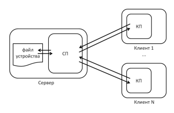

# Задание на лабораторную работу №1

## Цель: спроектировать и разработать две программы для для ОС Linux на языке программирования Python
Программы должны из себя 
   1. Сервис, отслеживающий изменения в состоянии «умного» устройства, имитируемого
      локальным файлом, согласно варианту лабораторной работы, и
      получающий/передающий запросы и ответы по сетевому протоколу управления,
      заданному вариантом лабораторной работы.
   2. Клиентскую программу для управления устройством через сервис (и проверки работы
      сервиса).

Сервис должен быть выполнен в виде консольного приложения, которое можно
запустить либо интерактивно в терминале, либо с помощью подсистемы инициализации и
управления службами systemd. Функциональность сервиса можно условно поделить на две
части: имитация взаимодействия (опроса или получения уведомлений) с устройством и
взаимодействие с клиентами по сети.  
&nbsp;&nbsp;&nbsp;&nbsp;Устройство, управление которым обеспечивает сервис, представляется в виде файла с
заданным форматом. Файл содержит данные о состоянии устройства. Внешнее изменение
файла соответствует внешним изменениям, которые могут произойти с устройством
(например, изменение режима работы устройства пользователем с помощью пульта
дистанционного управления).   
&nbsp;&nbsp;&nbsp;&nbsp;Сервис должен обнаруживать внешние изменения в состоянии
устройства и отправлять уведомления о таких изменениях заинтересованным клиентам.
Изменение состояния устройства может также быть выполнено с помощью клиентской
программы через сеть. В этом случае клиент отправляет серверу соответствующую команду
по протоколу управления, параметры которого определяются согласно варианту
лабораторной работы.  
&nbsp;&nbsp;&nbsp;&nbsp;Клиенская программа может быть выполнена в виде консольного приложения,
которое можно запустить интерактивно в терминале, или приложения с TUI/GUI. Любое
количество клиентов может подключиться к серверной части (сервису) и согласованно
управлять «устройством». Общая схема взаимодействия показана на Рис. 1.

 

&nbsp;&nbsp;&nbsp;&nbsp;Каждое устройство обладает набором параметров, значения которых могут быть
получены или изменены с помощью протокола управления. Изменение данных в файле
устройства вручную с помощью редактора соответствует внешнему изменению, которое
должно быть обнаружено сервисом. Функции в Табл. 3 условно соответствуют командам
протокола управления. Разработанный протокол может включать и другие команды.  
&nbsp;&nbsp;&nbsp;&nbsp;Вариант лабораторной работы представляет собой четырехзначное десятичное число
ABCD, каждая цифра которого расшифровывается по следующим правилам:

A – номер варианта устройства из Табл. 3;  

B – номер варианта формата хранения данных в файле, имитирующем устройство (далее –
файле устройства) из Табл. 4;

С – номер варианта формата передачи данных по прикладному протоколу управления из
Табл. 4;

D – номер варианта транспортного протокола из Табл. 5.
Выбор конкретных названий, типов, размеров, порядка хранения/передачи данных в
файле устройства и протоколе управления, конкретных архитектурных решений и прочего,
что не оговорено настоящим заданием, делается студентом самостоятельно в пределах
заданных вариантом требований и является творческим элементом задания.  

### Описание устройства
**Тип устройства** - Кондиционер

| Параметры устройства                                | Функции устройства                                                            |
|:----------------------------------------------------|:------------------------------------------------------------------------------|
| 1. Скорость работы (0 .. 10 условных единиц).       | 1. Задать режим и целевую температуру.                                        |
| 2. Целевая температура (15 .. 35 градусов Цельсия). | 2. Получить значения режима, целевой и текущей температуры.                   |  
| 3. Текущая температура воздуха (градусы Цельсия).   | 3. Получить уведомление об изменении режима, целевой или текущей температуры. | 

### Хранение в файле
      Binary

### Формат передачи по прикладному протоколу
      JSON

### Транспортный протокол
      UDP

